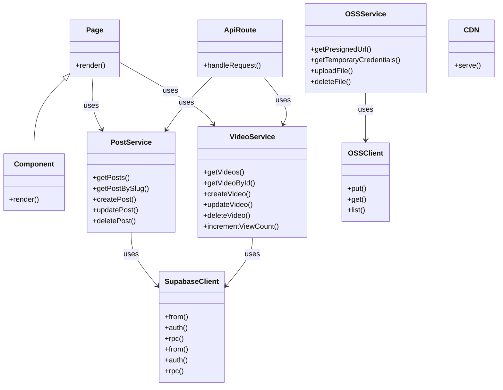

# 系统架构设计文档（修正版）

## 修正说明

本版本基于首席系统架构师的全面检视，对原 architecture.md 进行了以下关键修正：

1. **视频上传流程修正**：改为前端直传 OSS 模式，支持分片上传
2. **CDN 架构修正**：CDN 作为独立分发网络，不经过服务器
3. **系统设置表补充**：补充 settings 表设计
4. **视频专栏增强**：增加视频播放器、清晰度切换的详细设计

---

## 1. 技术选型

### 1.1 核心技术栈

| 组件 | 技术选型 | 选型理由 |
|------|---------|---------|
| **前端框架** | Next.js 14 (App Router) | React Server Components、静态/动态混合渲染、SEO友好、AI辅助开发效率高 |
| **编程语言** | TypeScript | 类型安全，AI辅助开发准确率高，减少运行时错误 |
| **样式方案** | Tailwind CSS | 原子化CSS，快速开发，支持暗色模式，AI写样式极快 |
| **UI组件库** | Shadcn/UI | 基于 Tailwind 的组件库，代码质量高，与Cline配合高效 |
| **Web服务器** | Node.js + Next.js | 轻量高效，运行在 Docker 容器中 |
| **数据库** | Supabase (PostgreSQL) | 云端托管，不占用服务器资源，自带 Auth 和 RLS，节省内存 |
| **视频存储** | 阿里云 OSS + CDN | 前端直传，CDN加速，不消耗服务器带宽 |
| **部署平台** | Docker + Docker Compose | 容器化部署，便于在阿里云轻量服务器上维护 |
| **代码质量** | ESLint + Prettier | 代码规范和格式化 |
| **HTTP客户端** | React Query | 数据获取和状态管理，内置缓存 |

### 1.2 架构策略

**动静分离 + 云端托管**：
- **静态资源**：Next.js 构建产物 → 阿里云轻量服务器 Docker
- **动态数据**：Supabase 云端 PostgreSQL
- **视频文件**：阿里云 OSS + CDN 加速分发

---

## 2. 目录结构设计

```
website/
├── docker/                          # Docker 相关配置
│   ├── Dockerfile                  # 应用镜像构建
│   ├── docker-compose.yml          # 服务编排
│   └── nginx/                      # Nginx 配置（可选反向代理）
│       └── nginx.conf
├── public/                          # 静态资源
│   ├── images/                     # 图片资源
│   ├── favicon.ico
│   ├── sitemap.xml
│   └── robots.txt
├── src/
│   ├── app/                        # Next.js App Router
│   │   ├── (public)/               # 公开页面路由组
│   │   │   ├── posts/              # 博客页面
│   │   │   │   ├── [slug]/         # 博客详情页
│   │   │   │   └── page.tsx        # 博客列表页
│   │   │   ├── videos/             # 视频页面
│   │   │   │   ├── [id]/           # 视频详情页
│   │   │   │   └── page.tsx        # 视频列表页
│   │   │   ├── categories/         # 分类页面
│   │   │   ├── tags/               # 标签页面
│   │   │   ├── about/              # 关于页面
│   │   │   ├── contact/            # 联系页面
│   │   │   └── page.tsx            # 首页
│   │   ├── (admin)/                # 管理员路由组（需要认证）
│   │   │   ├── dashboard/          # 管理后台首页
│   │   │   ├── posts/              # 博客管理
│   │   │   │   ├── new/            # 新建博客
│   │   │   │   ├── [id]/           # 博客编辑页
│   │   │   │   └── page.tsx        # 博客列表管理
│   │   │   ├── videos/             # 视频管理
│   │   │   │   ├── new/            # 上传视频
│   │   │   │   ├── [id]/           # 视频编辑页
│   │   │   │   └── page.tsx        # 视频列表管理
│   │   │   ├── settings/           # 系统设置
│   │   │   └── page.tsx            # 系统设置页
│   │   ├── api/                    # API Routes
│   │   │   ├── posts/
│   │   │   ├── comments/
│   │   │   ├── videos/
│   │   │   ├── oss-upload/         # OSS 上传凭证 API
│   │   │   └── likes/
│   │   ├── layout.tsx              # 根布局
│   │   ├── loading.tsx             # 加载状态
│   │   └── not-found.tsx           # 404页面
│   ├── components/                 # React 组件
│   │   ├── layout/                 # 布局组件
│   │   │   ├── Header.tsx          # 网站头部
│   │   │   ├── Footer.tsx          # 网站底部
│   │   │   ├── Navbar.tsx          # 导航栏
│   │   │   └── Container.tsx       # 容器组件
│   │   ├── blog/                   # 博客相关组件
│   │   │   ├── BlogCard.tsx        # 博客卡片
│   │   │   ├── BlogList.tsx        # 博客列表
│   │   │   ├── PostMeta.tsx        # 文章元信息
│   │   │   ├── PostNav.tsx         # 上下篇导航
│   │   │   ├── MarkdownRenderer.tsx # Markdown 渲染器
│   │   │   └── CommentList.tsx     # 评论列表
│   │   ├── video/                  # 视频相关组件
│   │   │   ├── VideoCard.tsx       # 视频卡片
│   │   │   ├── VideoList.tsx       # 视频列表
│   │   │   ├── VideoPlayer.tsx     # 视频播放器
│   │   │   ├── VideoUpload.tsx     # 视频上传
│   │   │   └── VideoQualitySelector.tsx # 清晰度切换选择器
│   │   ├── ui/                     # 基础 UI 组件
│   │   │   ├── Button.tsx          # 按钮
│   │   │   ├── Input.tsx           # 输入框
│   │   │   ├── Card.tsx            # 卡片
│   │   │   └── Modal.tsx           # 模态框
│   │   ├── auth/                   # 认证相关组件
│   │   │   ├── AuthForm.tsx        # 认证表单
│   │   │   └── ProtectedRoute.tsx  # 保护路由
│   │   └── oss/                    # OSS 上传组件
│   │       ├── OssUpload.tsx       # OSS 上传
│   │       ├── OssImage.tsx        # OSS 图片
│   │       └── OssVideoPlayer.tsx  # OSS 视频播放器
│   ├── lib/                        # 工具库
│   │   ├── supabase.ts             # Supabase 客户端
│   │   ├── ossClient.ts            # 阿里云 OSS 客户端
│   │   ├── types.ts                # TypeScript 类型定义
│   │   └── utils.ts                # 工具函数
│   ├── services/                   # 业务服务层
│   │   ├── postService.ts          # 博客服务
│   │   ├── videoService.ts         # 视频服务
│   │   └── ossService.ts           # OSS 服务
│   └── styles/                     # 全局样式
│       └── globals.css
├── tests/                          # 测试文件
│   ├── unit/                       # 单元测试
│   ├── integration/                # 集成测试
│   └── e2e/                        # E2E 测试
├── .eslintrc.json                  # ESLint 配置
├── .prettierrc                     # Prettier 配置
├── tsconfig.json                   # TypeScript 配置
├── next.config.js                  # Next.js 配置
├── tailwind.config.js              # Tailwind 配置
├── postcss.config.js               # PostCSS 配置
├── .env.local.example              # 环境变量示例
├── README.md                       # 项目说明
└── package.json                    # 项目依赖
```

### 2.1 目录职责说明

| 目录 | 职责 |
|------|------|
| `docker/` | Docker 相关配置，包含 Dockerfile、docker-compose.yml |
| `public/` | 静态资源，直接映射到根路径 |
| `src/app/` | Next.js App Router 路由定义 |
| `src/components/` | React 组件库 |
| `src/lib/` | 工具函数和客户端 SDK 封装 |
| `src/services/` | 业务逻辑服务层 |
| `src/styles/` | 全局样式文件 |
| `tests/` | 测试文件 |

---

## 3. 数据设计

### 3.1 核心实体关系图 (ERD)

```
┌─────────────────────┐        ┌─────────────────────┐
│      Users          │        │     Posts           │
├─────────────────────┤        ├─────────────────────┤
│ - id (PK)           │        │ - id (PK)           │
│ - email             │        │ - title             │
│ - name              │        │ - slug              │
│ - avatar_url        │        │ - content           │
│ - created_at        │        │ - category_id (FK)  │
│ - updated_at        │        │ - tags (JSON)       │
└─────────────────────┘        │ - status            │
         │                     │ - author_id (FK)    │
         │                     │ - created_at          │
         ▼                     │ - updated_at          │
┌─────────────────────┐        └─────────────────────┘
│    Categories       │                 │
├─────────────────────┤                 │
│ - id (PK)           │                 │
│ - name              │                 │
│ - slug              │                 │
│ - description       │                 │
└─────────────────────┘                 │
         │                              │
         ▼                              ▼
┌─────────────────────┐        ┌─────────────────────┐
│     Videos          │        │   Comments          │
├─────────────────────┤        ├─────────────────────┤
│ - id (PK)           │        │ - id (PK)           │
│ - title             │        │ - content           │
│ - description       │        │ - post_id (FK)      │
│ - oss_url           │        │ - author_id (FK)    │
│ - thumbnail_url     │        │ - parent_id (FK)    │
│ - duration          │        │ - created_at        │
│ - view_count        │        │ - updated_at        │
│ - created_at        │        └─────────────────────┘
│ - updated_at        │
└─────────────────────┘
         │
         ▼
┌─────────────────────┐
│    Settings         │
├─────────────────────┤
│ - id (PK)           │
│ - key (unique)      │
│ - value (JSONB)     │
│ - description       │
│ - created_at        │
│ - updated_at        │
└─────────────────────┘
```

### 3.2 数据表设计

#### 3.2.1 Users (用户表)

| 字段 | 类型 | 说明 |
|------|------|------|
| id | UUID | 主键 |
| email | TEXT | 邮箱（唯一） |
| name | TEXT | 昵称 |
| avatar_url | TEXT | 头像 URL |
| created_at | TIMESTAMPTZ | 创建时间 |
| updated_at | TIMESTAMPTZ | 更新时间 |

#### 3.2.2 Posts (博客文章表)

| 字段 | 类型 | 说明 |
|------|------|------|
| id | UUID | 主键 |
| title | TEXT | 标题 |
| slug | TEXT | SEO友好的URL |
| content | JSONB | Markdown 内容 |
| category_id | UUID | 分类外键 |
| tags | TEXT[] | 标签数组 |
| status | VARCHAR | 状态（draft/published） |
| author_id | UUID | 作者外键 |
| view_count | INTEGER | 浏览次数 |
| created_at | TIMESTAMPTZ | 创建时间 |
| updated_at | TIMESTAMPTZ | 更新时间 |

#### 3.2.3 Categories (分类表)

| 字段 | 类型 | 说明 |
|------|------|------|
| id | UUID | 主键 |
| name | TEXT | 分类名称 |
| slug | TEXT | SEO友好的URL |
| description | TEXT | 分类描述 |

#### 3.2.4 Videos (视频表)

| 字段 | 类型 | 说明 |
|------|------|------|
| id | UUID | 主键 |
| title | TEXT | 视频标题 |
| description | TEXT | 视频描述 |
| oss_url | TEXT | OSS 文件 URL |
| thumbnail_url | TEXT | 封面图 URL |
| duration | INTEGER | 时长（秒） |
| view_count | INTEGER | 浏览次数 |
| created_at | TIMESTAMPTZ | 创建时间 |
| updated_at | TIMESTAMPTZ | 更新时间 |

#### 3.2.5 Comments (评论表)

| 字段 | 类型 | 说明 |
|------|------|------|
| id | UUID | 主键 |
| content | TEXT | 评论内容 |
| post_id | UUID | 关联文章 |
| author_id | UUID | 作者外键 |
| parent_id | UUID | 父评论（支持回复） |
| created_at | TIMESTAMPTZ | 创建时间 |
| updated_at | TIMESTAMPTZ | 更新时间 |

#### 3.2.6 Settings (系统设置表)

| 字段 | 类型 | 说明 |
|------|------|------|
| id | UUID | 主键 |
| key | TEXT | 配置键（唯一） |
| value | JSONB | 配置值 |
| description | TEXT | 配置描述 |
| created_at | TIMESTAMPTZ | 创建时间 |
| updated_at | TIMESTAMPTZ | 更新时间 |

### 3.3 TypeScript 类型定义

```typescript
// src/lib/types.ts

// 用户类型
export interface User {
  id: string;
  email: string;
  name: string;
  avatar_url: string;
  created_at: string;
  updated_at: string;
}

// 分类类型
export interface Category {
  id: string;
  name: string;
  slug: string;
  description: string;
}

// 博客文章类型
export interface Post {
  id: string;
  title: string;
  slug: string;
  content: any; // Markdown 内容
  category_id: string;
  tags: string[];
  status: 'draft' | 'published';
  author_id: string;
  view_count: number;
  created_at: string;
  updated_at: string;
}

// 视频类型
export interface Video {
  id: string;
  title: string;
  description: string;
  oss_url: string;
  thumbnail_url: string;
  duration: number;
  view_count: number;
  created_at: string;
  updated_at: string;
}

// 评论类型
export interface Comment {
  id: string;
  content: string;
  post_id: string;
  author_id: string;
  parent_id: string | null;
  created_at: string;
  updated_at: string;
}

// 系统设置类型
export interface Setting {
  id: string;
  key: string;
  value: any;
  description: string;
  created_at: string;
  updated_at: string;
}

// OSS 临时凭证类型
export interface OssCredentials {
  AccessKeyId: string;
  AccessKeySecret: string;
  SecurityToken: string;
  Expiration: string;
  Bucket: string;
  Region: string;
}

// 视频清晰度选项
export interface VideoQuality {
  label: string;
  bitrate: number; // kbps
  width: number;
  height: number;
}
```

---

## 4. 类图设计



### 4.1 核心类说明

| 类名 | 职责 |
|------|------|
| `PostService` | 博客文章业务逻辑，CRUD操作 |
| `VideoService` | 视频业务逻辑，CRUD操作，播放统计 |
| `OSSService` | 阿里云 OSS 上传和文件管理 |
| `SupabaseClient` | Supabase 客户端封装 |
| `AuthForm` | 认证表单组件 |
| `ProtectedRoute` | 路由保护组件 |
| `VideoPlayer` | 视频播放器组件，支持倍速、清晰度切换 |
| `VideoUpload` | 视频上传组件，支持分片上传 |

---

## 5. 时序图设计

### 5.1 首页加载时序图

```
┌──────┐     ┌──────┐     ┌──────┐     ┌──────┐
│Browser│     │Server│     │Supabase│   │  OSS   │
└──────┘     └──────┘     └──────┘     └──────┘
    │            │            │            │
    │  1. GET /  │            │            │
    │───────────>│            │            │
    │            │  2. Query  │            │
    │            │───────────>│            │
    │            │  3. Return │            │
    │            │<───────────│            │
    │            │  4. Render │            │
    │            │───────────>│            │
    │  5. HTML   │            │            │
    │<───────────│            │            │
    │            │            │            │
    │  6. Fetch  │            │            │
    │───────────>│            │            │
    │            │  7. Query  │            │
    │            │───────────>│            │
    │            │  8. Return │            │
    │            │<───────────│            │
    │  9. JSON   │            │            │
    │<───────────│            │            │
    │            │            │            │
    │ 10. Render │            │            │
    │───────────>│            │            │
    │            │            │            │
```

### 5.2 文章发布时序图

```
┌──────┐     ┌──────┐     ┌──────┐     ┌──────┐
│Browser│     │Server│     │Supabase│   │  OSS   │
└──────┘     └──────┘     └──────┘     └──────┘
    │            │            │            │
    │ 1. POST /  │            │            │
    │   api/posts│            │            │
    │───────────>│            │            │
    │            │ 2. Validate│            │
    │            │───────────>│            │
    │            │ 3. Insert  │            │
    │            │───────────>│            │
    │            │ 4. Return  │            │
    │            │<───────────│            │
    │ 5. JSON    │            │            │
    │<───────────│            │            │
```

### 5.3 视频上传时序图（修正版 - 前端直传）

```
┌──────┐     ┌──────┐     ┌──────┐     ┌──────┐
│Browser│     │Server│     │Supabase│   │  OSS   │
└──────┘     └──────┘     └──────┘     └──────┘
    │            │            │            │
    │ 1. Get OSS │            │            │
    │   Credentials│            │            │
    │───────────>│            │            │
    │            │ 2. Generate│            │
    │            │ Temporary  │            │
    │            │ Credentials│            │
    │            │───────────>│            │
    │            │ 3. Return  │            │
    │            │<───────────│            │
    │ 4. OSS     │            │            │
    │   Credentials│            │            │
    │<───────────│            │            │
    │            │            │            │
    │ 5. Upload  │            │            │
    │   (split   │            │            │
    │   chunks)  │            │            │
    │─────────────────────────>│            │
    │            │            │            │
    │ 6. Success │            │            │
    │<─────────────────────────│            │
    │            │            │            │
    │ 7. Save    │            │            │
    │   metadata │            │            │
    │───────────>│            │            │
    │            │ 8. Insert  │            │
    │            │───────────>│            │
    │            │ 9. Return  │            │
    │            │<───────────│            │
    │ 10. JSON   │            │            │
    │<───────────│            │            │
```

### 5.4 视频播放时序图

```
┌──────┐     ┌──────┐     ┌──────┐     ┌──────┐
│Browser│     │Server│     │Supabase│   │  OSS   │
└──────┘     └──────┘     └──────┘     └──────┘
    │            │            │            │
    │ 1. GET /   │            │            │
    │   videos/x │            │            │
    │───────────>│            │            │
    │            │ 2. Query   │            │
    │            │ Video data │            │
    │            │───────────>│            │
    │            │ 3. Return  │            │
    │            │<───────────│            │
    │            │ 4. Render  │            │
    │            │ HTML with  │            │
    │            │ VideoPlayer│            │
    │            │───────────>│            │
    │ 5. HTML    │            │            │
    │<───────────│            │            │
    │            │            │            │
    │ 6. Load    │            │            │
    │   video    │            │            │
    │─────────────────────────>│            │
    │            │            │            │
    │ 7. Stream  │            │            │
    │   via CDN  │            │            │
    │<─────────────────────────│            │
```

---

## 6. 数据流图

### 6.1 前台数据流

```
┌─────────────────────────────────────────────────────────────┐
│                      Frontend Layer                         │
│  ┌──────────────┐  ┌──────────────┐  ┌──────────────┐      │
│  │   Home       │  │   Blog       │  │   Video      │      │
│  │   Page       │  │   Page       │  │   Page       │      │
│  └──────────────┘  └──────────────┘  └──────────────┘      │
└─────────────────────────────────────────────────────────────┘
                            │
                            ▼
┌─────────────────────────────────────────────────────────────┐
│                       Service Layer                         │
│  ┌──────────────┐  ┌──────────────┐  ┌──────────────┐      │
│  │ React Query  │  │  PostService │  │ VideoService │      │
│  │   Cache      │  │              │  │              │      │
│  └──────────────┘  └──────────────┘  └──────────────┘      │
└─────────────────────────────────────────────────────────────┘
                            │
                            ▼
┌─────────────────────────────────────────────────────────────┐
│                       Data Layer                            │
│  ┌──────────────┐  ┌──────────────┐  ┌──────────────┐      │
│  │ Supabase     │  │   OSS Client │  │   CDN        │      │
│  │   Client     │  │              │  │   Assets     │      │
│  └──────────────┘  └──────────────┘  └──────────────┘      │
└─────────────────────────────────────────────────────────────┘
```

### 6.2 后台数据流

```
┌─────────────────────────────────────────────────────────────┐
│                      Admin Layer                            │
│  ┌──────────────┐  ┌──────────────┐  ┌──────────────┐      │
│  │ Dashboard    │  │  Content Mgmt│ │  System      │      │
│  │              │  │  (Posts/Videos)││  Settings    │      │
│  └──────────────┘  └──────────────┘  └──────────────┘      │
└─────────────────────────────────────────────────────────────┘
                            │
                            ▼
┌─────────────────────────────────────────────────────────────┐
│                    Admin API Routes                         │
│  ┌──────────────┐  ┌──────────────┐  ┌──────────────┐      │
│  │ Auth         │  │  Content     │  │  OSS Upload  │      │
│  │   Protection │  │   Management │  │   Presigned  │      │
│  └──────────────┘  └──────────────┘  └──────────────┘      │
└─────────────────────────────────────────────────────────────┘
                            │
                            ▼
┌─────────────────────────────────────────────────────────────┐
│                       Service Layer                         │
│  ┌──────────────┐  ┌──────────────┐  ┌──────────────┐      │
│  │ PostService  │  │ VideoService │  │  OSSService  │      │
│  └──────────────┘  └──────────────┘  └──────────────┘      │
└─────────────────────────────────────────────────────────────┘
                            │
                            ▼
┌─────────────────────────────────────────────────────────────┐
│                       Data Layer                            │
│  ┌──────────────┐  ┌──────────────┐  ┌──────────────┐      │
│  │ Supabase     │  │   OSS Client │  │   CDN        │      │
│  │   Client     │  │              │  │   Assets     │      │
│  └──────────────┘  └──────────────┘  └──────────────┘      │
└─────────────────────────────────────────────────────────────┘
```

### 6.3 视频播放数据流（修正版）

```
┌─────────────────────────────────────────────────────────────┐
│                      Frontend Layer                         │
│  ┌──────────────────────────────────────────────────────┐   │
│  │  VideoPlayer Component                               │   │
│  │  - Load metadata from Supabase                       │   │
│  │  - Stream video directly from CDN                    │   │
│  └──────────────────────────────────────────────────────┘   │
└─────────────────────────────────────────────────────────────┘
                            │
                            ▼
┌─────────────────────────────────────────────────────────────┐
│                        Data Layer                           │
│  ┌──────────────┐  ┌──────────────┐  ┌──────────────┐      │
│  │ Supabase     │  │   CDN        │  │   OSS        │      │
│  │   (metadata) │  │   (video    │  │   (source)   │      │
│  │              │  │    files)   │  │              │      │
│  └──────────────┘  └──────────────┘  └──────────────┘      │
└─────────────────────────────────────────────────────────────┘
```

---

## 7. 核心模块职责划分

### 7.1 前端模块

| 模块 | 职责 |
|------|------|
| `app/(public)/` | 公开页面路由（首页、博客、视频等） |
| `app/(admin)/` | 管理员专用页面路由（需要认证） |
| `components/` | 可复用的 React 组件 |
| `lib/` | 工具函数、类型定义、客户端 SDK |
| `services/` | 业务逻辑服务层 |

### 7.2 后端模块

| 模块 | 职责 |
|------|------|
| `app/api/` | API 路由处理器 |
| `services/` | 业务逻辑服务层 |
| `lib/supabase.ts` | Supabase 客户端封装 |
| `lib/ossClient.ts` | 阿里云 OSS 客户端封装 |

### 7.3 部署模块

| 模块 | 职责 |
|------|------|
| `docker/Dockerfile` | 应用镜像构建 |
| `docker/docker-compose.yml` | 服务编排 |
| `docker/nginx/` | Nginx 反向代理配置 |

---

## 8. 部署架构图（修正版）

```mermaid
flowchart TB
    subgraph Internet
        Browser[Browser]
    end
    
    subgraph CDN
        CDNEdge[CDN Edge Nodes]
        OSS[阿里云 OSS]
        CDN[阿里云 CDN]
        
        OSS -->|存储源文件| CDN
        CDN -->|分发视频| CDNEdge
    end
    
    subgraph Server
        Docker[阿里云轻
